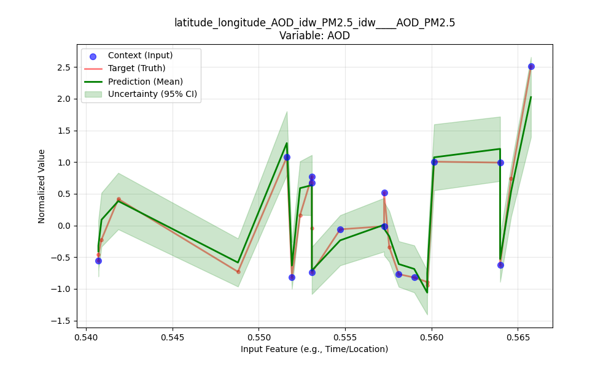
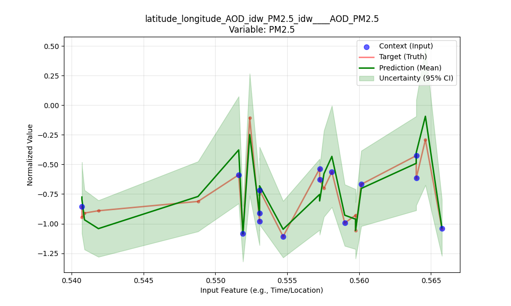

# Master's Thesis Repository

## Neural Process Models for Spatio-Temporal Reconstruction of AOD and PM2.5

This repository presents the computational framework developed for a Master's thesis on probabilistic deep learning for air-quality reconstruction. The study focuses on Neural Process (NP) models to recover the spatio-temporal structure of Aerosol Optical Depth (AOD) and PM2.5 under sparse and heterogeneous observations, while explicitly modeling predictive uncertainty.

The implementation covers the full experimental lifecycle: data preparation, geospatial encoding, model training, checkpointing, quantitative evaluation, and figure generation.

## Final Results (Selected Figures)

The following figures correspond to the final evaluation run and represent the principal visual results reported in this repository.

### Final AOD Result



*Figure 1. Final model output for AOD in the joint AOD-PM2.5 configuration (`latitude_longitude_AOD_idw_PM2.5_idw -> AOD_PM2.5`).*

### Final PM2.5 Result



*Figure 2. Final model output for PM2.5 in the same joint configuration (`latitude_longitude_AOD_idw_PM2.5_idw -> AOD_PM2.5`).*

## Research Objectives

The thesis is structured around four research objectives:
- reconstruct AOD and PM2.5 as spatially and temporally coherent fields;
- assess predictive performance across multiple feature configurations;
- evaluate uncertainty quality through likelihood and coverage diagnostics;
- ensure reproducibility of the complete computational pipeline.

## Repository Structure

- `configs/`: experiment and preprocessing configuration files.
- `Dataloader/`: data ingestion, harmonization, and dataset pipeline logic.
- `locationencoder/`: geospatial encoder implementation.
- `src/Models/`: Neural Process modules (encoder, latent encoder, decoder, robust variants).
- `src/training/`: objective functions, training utilities, and training scripts.
- `src/evaluation/`: evaluation routines, metrics export, and plotting.
- `Gpu_checkpoints_tum/`: trained model checkpoints (GPU runs).
- `GPU_final_results/`: tabular summaries of final evaluation metrics.
- `final_plots/`: generated figures from evaluation runs.
- `tests/`: unit and integration testing code.
- `docker/`: containerization files for environment reproducibility.

## Methodological Summary

### Data and Feature Engineering

The data pipeline integrates air-quality and geospatial variables into model-ready tensors. Experiments are configured for multiple input-output combinations, including coordinate-only, AOD-only, PM2.5-only, and joint feature sets.

### Geospatial Encoding

Latitude-longitude coordinates are transformed through a dedicated spatial encoder, allowing the NP model to learn location-aware representations beyond raw coordinate values.

### Neural Process Formulation

The model architecture follows a standard NP design:
- a context encoder maps observed pairs to latent representations;
- a latent encoder parameterizes prior/posterior distributions;
- a decoder produces predictive means and uncertainties at target locations.

### Training Objective

Optimization is performed through an ELBO-inspired objective with:
- reconstruction term based on negative log-likelihood (NLL);
- KL regularization between posterior and prior latent distributions.

### Evaluation Protocol

Model quality is assessed on held-out splits using:
- RMSE;
- R2;
- NLL;
- empirical coverage statistics.

Evaluation artifacts are written to run-specific folders in `final_plots/` and `GPU_final_results/`.

## Installation

```bash
git clone <repository-url>
cd Master-Thesis
python -m venv .venv
source .venv/bin/activate
pip install -r requirements.txt
```

## Running the Pipeline

### Training

```bash
python src/training/trainer_latlon_AOD_PM25.py
```

Training outputs are saved under timestamped directories (for example, in `Gpu_checkpoints_tum/` and `logs_20km/`).

### Evaluation

```bash
python src/evaluation/uncertainty_analysis_prediction.py
```

This script generates:
- figures in `final_plots/`;
- metric tables in `GPU_final_results/`.

## Reproducibility

- Random seeds are fixed in key scripts to reduce run-to-run variability.
- Run folders are timestamped for traceable experiment history.
- Naming conventions encode input-output experiment settings.
- Core options are centralized in `configs/`.

## Testing

```bash
pytest -q
```

Some research scripts may require local configuration and data-path adjustments before execution in a new environment.

## Citation

If this repository is used in academic work, please cite the associated Master's thesis and acknowledge this implementation.

## License

This project is released under the terms described in `LICENSE`.
