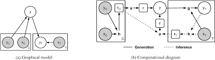

# In this folder we will implement the theory of model in to the coding,

### There are 4 different parts of this architecture as given in the research paper [Neural_Process](https://arxiv.org/pdf/1807.01622) and [Variational Auto Encoder](https://www.datacamp.com/de/tutorial/variational-autoencoders)
 

- [ ] Encoder : h(Xc,Yc) -> ri
- [ ] Aggregator : a(ri) -> r
- [ ] Sampler : s(r) -> (&mu;(r), &sigma;(r)) ~ z
- [ ] Decoder : g(XT, z) -> &mu;, &sigma; of the target values with uncertainty.

From here decoder will produce the value of the 

## Data cleaning as we as deviding it to training and test data.

Once we have the cleaned and desired data we will devide it to the `contextual data`(Xc, Yc) as well as `training data`(XT,YT). 

## Encoder to generate the representation embeddings : 
### In this section we will look in to the working process of the encoder.

Contextual data Xc, Yc values will be passed to the Encoder.

And the out-put embeddings will be stored in the form of representations ri

## 
h(Xc,Yc) -> ri 

## Aggregator :

This is the mean function for all the representations ri

## 
 r =$\sum_{i=1}^{n} r_i$ 

## Latent Encoder for z : 

### In this section we will see that this encoder takes mean representation as an input and as an out-put it gives the mean and log variance that represents the distribution of z 

## 
LE(r) = &mu;(z), log &sigma;(z)

## Sampling z from here. 

### we consider $\epsilon \sim \mathcal{N}(0, 1)$ is normally distributed random variable. 

##  
$z \sim \mathcal{N}(\mu, \sigma^2)$ 

### Reparametrization technique :
## 
 $z = \mu(z)+\epsilon*\sigma(z)$

## Decoder :

### Once we have sampled z from here now this will be an output for the decoder model.

## 
 $g(X_T, z) = \mu, log\sigma$

## 
 $var = \exp^{(2*log\sigma)}$

## 
$\mu = \mu$

### As we can see above we have gained the mean and variance that provids us the target predicted values with some uncertainty. 

### Hence here we are not getting the deterministic values instead of that we are getting the distribution of the values. 

