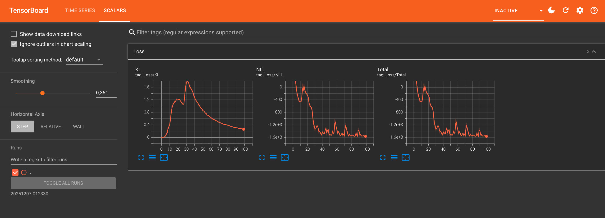
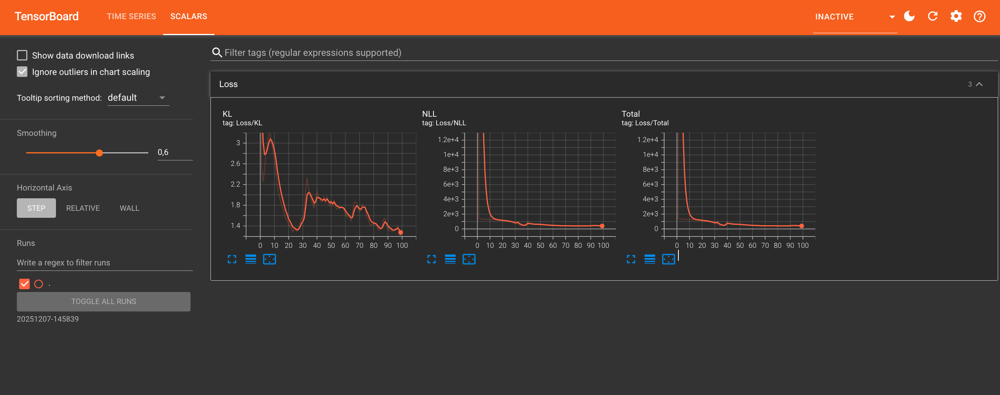
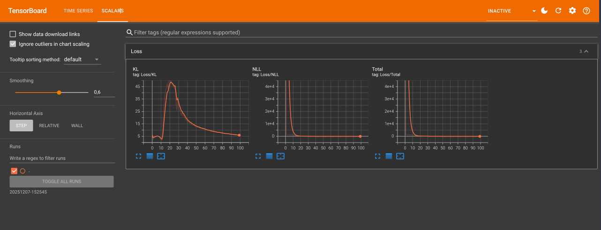
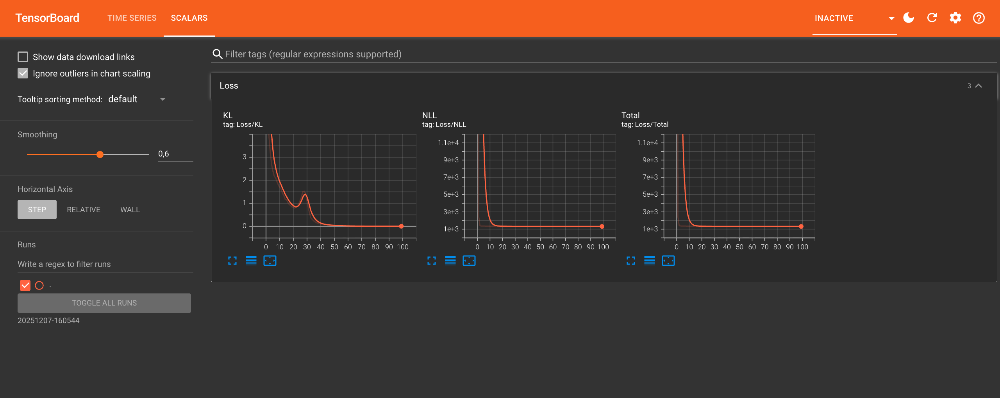

<h3 align = "center">First loss with lat_lon_AOD_PM2.5 data set visual with lr = 10(-5) in training data <h3>



<h3 align = "center"> Second loss with lat_lon_AOD data set visual with lr = 10(-5)<h3>




<h3 align = "center"> Third loss with lat_lon_PM25 data set visual with lr = 10(-5)<h3>




<h3 align = "center"> Fourth loss with lat_lon data set visual with lr = 10(-5)<h3>




<h3 align = "center" > Univariate model losses in training data set . <h3>

<h4 align = "center" >In this data-set we will have only PM2.5 as an output and the input variables will be lat, long, AOD, PM2.5 values. <h4>

```js
Inputs = [latitude, longitude, AOD, PM2.5]
Outputs = [PM2.5]
```

